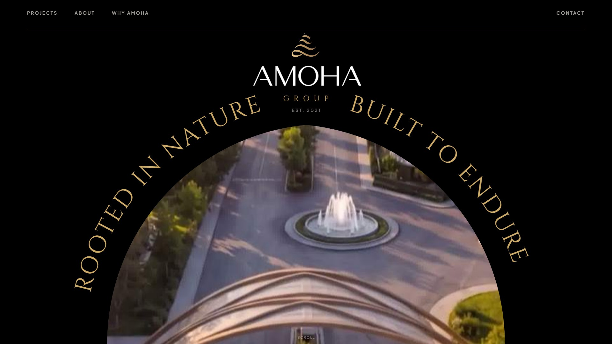
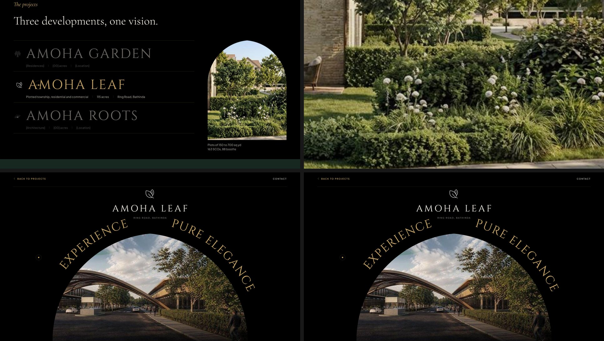
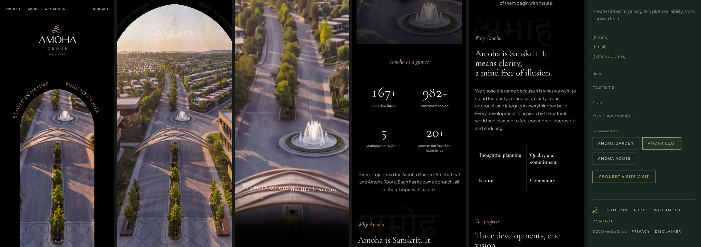

# Amoha Group landing page, client preview

**Live preview:** https://jatin-dhir.github.io/amoha-preview/
**Design boards:** https://jatin-dhir.github.io/amoha-preview/design/

A temporary preview of the new Amoha Group website concept for client review. One idea drives it:
a clear opening in the dark. The page is black, the only light comes through one pointed arch, and
scrolling opens that arch until the whole screen is the estate.



## What to try

- Let the loader draw the arch, then scroll: the arch opens, the estate settles, the vision statement writes itself.
- Keep scrolling: the stats count up and each section slides over the previous one.
- Hover a project in "The projects" and the arch on the right fills with it; click **Amoha Leaf** to go through the arch into its page.
- On the project page, drag the clubhouse strip; use **Back to projects** in the top bar (or Escape) to return.



Best viewed on a desktop browser at 1440 px wide or more. The phone layout is a simpler single column with the same hero.



## How it is built

A single `index.html` with no build step. All photographs are inlined as data URIs. Motion is GSAP 3.13
(ScrollTrigger, Draggable, InertiaPlugin) with Lenis for smooth scrolling; the pointed arch is a CSS
`clip-path: path()` recomputed from the viewport width (h = 0.55 W, R = 0.5525 W), and the inscription is
SVG text on a path offset from the same arch. `prefers-reduced-motion` renders the open state with no pinning.

`design/index.html` is a static gallery of the sixteen design boards (rendered images).

## Run locally

```bash
python -m http.server 4173
```

Then open http://127.0.0.1:4173/ (the page must be served with a doctype-bearing document, which this file is).

## Network dependencies

- Fonts from Google Fonts (Cinzel, Cormorant Garamond, Plus Jakarta Sans, Tiro Devanagari Sanskrit)
- GSAP 3.13.0 from cdnjs.cloudflare.com; Lenis 1.1.18 from cdn.jsdelivr.net

## Content status

Copy and figures come from Amoha Group's own material (170+ acres, 1,000+ customers, established 2021, founders with
20+ years). Facts shown in square brackets are placeholders awaiting the client. Photographs and renders are taken from
the client's existing Amoha Leaf and Amoha Group sites as placeholders and will be replaced.

This repository exists only for viewing the preview. No reuse rights are granted.
